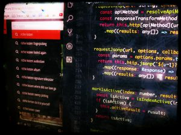
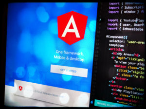
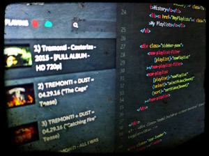
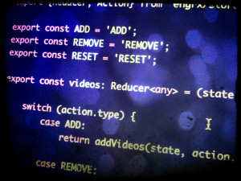
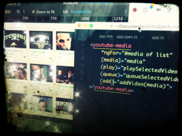
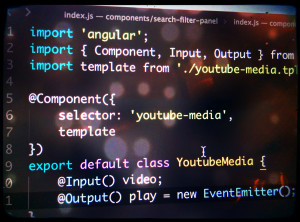
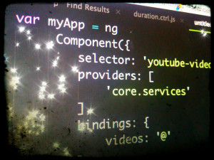

## Orizen's Angular Articles Series

This page includes the full series of high quality articles on working with [Angular](https://angular.io) published in [Orizen's blog](/).

This series is **kept updated** with new articles that are published here.

Be sure to checkout my live open source live projects:

- [Echoes Player](https://echoesplayer.netlify.app/) ([Angular Source Code](http://github.com/orizens/echoes-player))
- [Orizens npm packages](http://npmjs.com/~orizens)

## Online Angular & NGRX Workshop

[Sign Up Today](https://goo.gl/WirC74) to the Orizen's Online Angular and NGRX Workshop which includes: getting familiar with ngrx/store, ngrx/effects, ngrx/entity and more in Angular.

## Front End Consulting & Development Offer By Orizens

Starting out with the new **Angular**? Upgrading Angular? Looking to **plan ahead** and start a **new project**?

Check out [My Services](/about), [Write to me](/contact) to ask any question

[Get A Special Quote For Yout Project / Consulting](https://docs.google.com/forms/d/e/1FAIpQLSc341_p9YiUeMHipBMDujCv0bHJfQD1NKWFvoYkcJiFeMm4Ig/viewform)

## Angular (2, 4, 5 and above) Article Series

### Ngrx, Scrolling Into DOM Elements & Components Communication

My open source app, Echoes Player, allows to consume and create a "now" playlist - where you can queue media

[Read More ...](/blog/ngrx-scrolling-ino-dom-element-and-components-communication/)

### Upgrading to Angular 5: Using HttpClient, JSONP with parameters

Angular released version 5 - deprecating the old http module "@angular/http" with the replacement of "@angular/common/http". Along with the http

[Read More ...](/blog/upgrading-to-angular-5-using-httpclient-jsonp-with-parameters/)

### Decluttering Angular Components: The Proxy Pattern

I like to write clear and maintainable code. To be honest - sometimes I just don't. However, I always look

[Read More ...](/blog/decluttering-angular-components-the-proxy-pattern/)

### Reusing ngrx/effects in Angular (communicating between reducers)

After upgrading my open source project, "Echoes Player", to work with the latest stable angular-cli 1.0 version (wrote an article

[Read More ...](/blog/reusing-ngrxeffects-in-angular-communicating-between-reducers/)

### Guidelines For developing with Angular, ngrx/store, ngrx/effects & AOT

With angular-cli tool entering RC-1, I decided to start migrating my open source project "Echoes Player" from angular class boilerplate.

[Read More ...](/blog/guidelines-for-developing-with-angular-ngrxstore-ngrxeffects-aot/)

### Lessons Learned from Creating A Typeahead With RxJs And Angular

Following recent articles on development of Echoes Player, my open source media player built with Angular, I really wanted to

[Read More ...](/blog/lessons-learned-from-creating-a-typeahead-with-rxjs-and-angular-2/)

### Simple Action Creators for ngrx/store in Angular (2+)

In the development of Echoes Player (ng2 version),  I'm using ngrx/store for state management and ngrx/effects for logics with side effects.

[Read More ...](/blog/simple-action-creators-for-ngrxstore-in-angular-2/)

### Stepping Into The Next Level With RxJs In Angular (2+)

Since I started developing the new version of Echoes with Angular (+2), I was vey interested in taking advantage of

[Read More ...](/blog/stepping-into-the-next-level-with-rxjs-in-angular-2/)

### Angular (2+): From Services To Reactive Effects With Ngrx/Effects

In a former article, I wrote an introduction for integrating ngrx/effects with Angular (+2) - a functional approach for reacting to

[Read More ...](/blog/angular-2-from-services-to-reactive-effects-with-ngrxeffects/)

### Angular 2 Final Version Is Live - Resource: Start With Ngrx Tools

It's official - Angular version 2.0.0 is live. It's been a long ride until the official announcement, and so until then,

[Read More ...](/blog/angular-2-final-version-is-live-start-with-ngrx-tools/)

### Angular (2+), Ngrx/Store & Ngrx/Effects - Intro To Functional Approach For A Chain Of Actions

The Ngrx projects adds functional approach to various interesting architectural implementations. I wrote about my experience with storing data using

[Read More ...](/blog/angular-2-ngrxstore-ngrxeffects-intro-to-functional-approach-for-a-chain-of-actions/)

### Angular (2+) NgZone Intro - The new "scope.apply"

Adding youtube player and google sign-in features to the echoes player version that I started developed with Angular (+2) was

[Read More ...](/blog/angular-2-ngzone-intro-the-new-scope-apply/)

### Angular (2+) - Communication Between Components & Components Design

In the last article, I added the ability to play a media in Echoes Player. I introduced a new reducer

[Read More ...](/blog/angular-2-communication-between-components-components-design/)

### Adding Redux with NgRx/store to Angular (2+) - Part 2 (Testing Reducers)

In my recent article about adding redux with ngrx/store to angular2, I showed a nice example of integrating this awesome

[Read More ...](/blog/adding-redux-with-ngrxstore-to-angular2-part-2-testing-reducers/)

### Angular (2+) & NgRx/store: The NgModel In Between Use Case (from Angular 1)

In the recent article, I integrated ngrx/store as a redux implementation to Echoes Player. Until this article, the search was

[Read More ...](/blog/angular-2-ngrxstore-the-ngmodel-in-between-use-case-from-angular-1/)

### Adding Redux with NgRx/Store to Angular (2+) - Part 1

The recent trend in state management has rise thanks to the popular library - Redux. I was very interested in

[Read More ...](/blog/adding-redux-with-ngrxstore-to-angular-2-part-1/)

### Angular (2+): Attribute @Directive() & Creating An Infinite Scroll Directive

In the recent article, I used the new "ng-repeat" in Angular (+2), "NgFor", and created component that consumes other custom component. In

[Read More ...](/blog/angular-2-attribute-directive-creating-an-infinite-scroll-directive/)

### From Angular 1.x ng-repeat to Angular (2+) NgFor with Component

In the recent article, I wrote about the migration process of a component that is based on AngularJS.x and ES2015. Since

[Read More ...](/blog/from-angular-1-x-ng-repeat-to-angular-2-ngfor-with-component/)

### Migrating A Component To Angular (2+): From Angular 1.x & Es2015

Following Echoes Player article series about angular & ES2015, I decided to develop this project with angular2. I intend to write

[Read More ...](/blog/migrating-a-component-to-angular-2-from-angular-1-x-es2015/)

### From Angular ES5 Directive To Angular ES2015 Component (ES6)

Recently, I started refactoring Echoes Player, my open source project, from angular ES5 to AngularJS with ES2015 (former ES6). I'm following

[Read More ...](/blog/from-angular-es5-directive-to-angular-es2015-component/)

### Angular (2+): To Typescript or To ES5?

…that is the question. Aside from migrating AngularJS.x code to Angular (+2) using few steps, i’ve been playing around with Angular

[Read More ...](/blog/angular-2-to-typescript-or-to-es5/)

### 3 More Steps To Prepare Your Angular 1 Code To Angular (2+)

Angular (+2) Beta has been released just a few days ago. The most significant announcement with this beta is that the

[Read More ...](/blog/3-more-steps-to-prepare-your-angular-1-code-to-angular-2/)

### 5 Steps To Prepare Your Angular 1.x Code To Angular (2+)

I’ve been playing around with Angular (+2) (alpha v 0.46 now) lately. At first, it seemed strange and totally different

[Read More ...](/blog/5-steps-to-prepare-your-angular-1-code-to-angular-2/)
